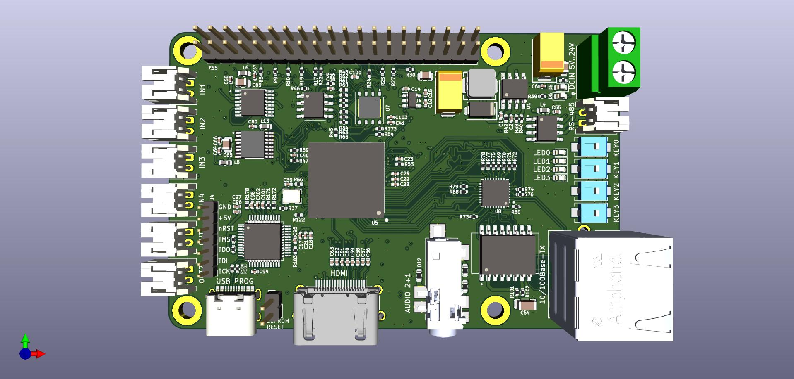
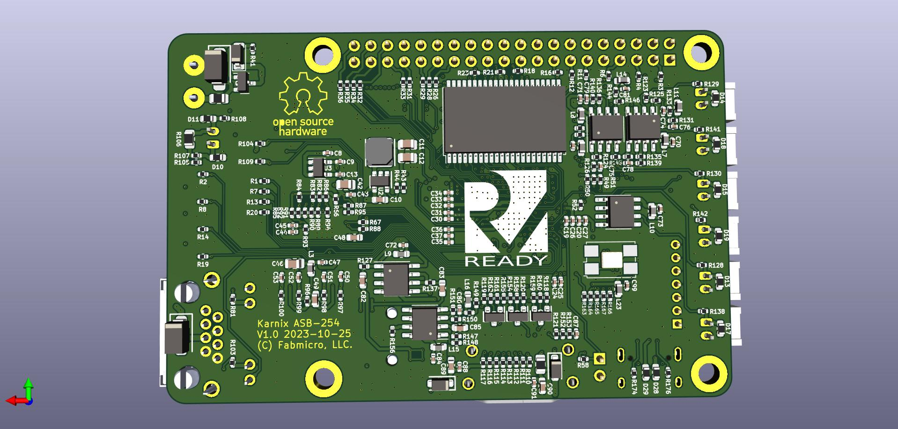

# Karnaugh Interactive Extendable ASIC Simulation Board AKA Karnix ASB-254.

## Features:

- RPi3 form factor board with 40pin head connector
- Lattice ECP5 25K FPGA, RISC-V ready
- SRAM 16x256 KBits (512 KB)
- NOR flash 128 MBits for FPGA configs
- EEPROM 1Kbits (128 bytes) for user settings
- Ethernet 10/100Base-TX
- RS-485 transceiver
- HDMI connector directly connected to FPGA
- SPI DAC 4 channels (2 for audio)
- SPI ADC 4 channels + 1 mic in
- 4 keys and 4 LEDs
- 4 pin audio jack connected to DAC/ADC
- Built-in FT2232D based programmer

## Board images

# Karnix v1.0 bugs

Version 1.0 appeared to be buggy:
- Ethernet does not work because of wrong power wiring.
- FT2232D IOVCC was wrongly wired to +5V instead of +3V3.
- Some issues with footprints.

## Examples

- Directory **Examples/VexRiscvWithHUB12ForKarnix** contains complete implementation of HUB-12/HUB-75 adapter for LED matrixes written in C running on VexRiscv soft-core. It provides Modbus/UDP interface to corresponding LED matrix.

## Video

https://www.youtube.com/watch?v=xr0pdGuJbXQ
